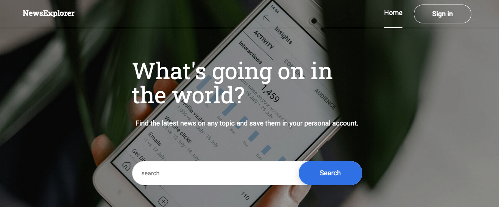

# press --> [deployed app](https://www.explorer-news.students.nomoreparties.sbs/)

# press ---> [api](https://api.explorer-news.students.nomoreparties.sbs/)

External IP -- 34.145.108.163



### 🛠  Tech Stack

 
 
 
 
 
 
 
 
 
 


## Markup and JSX
 

### Create React App

using [Create React App](https://create-react-app.dev/) 

 

#### NPM
```bash
npm start
```

 
### File structure and components

* For React components: `components`
* For auxiliary functions and API requests: `utils`
* For images: `images`
* For third-party resources such as fonts: `vendor`


```bash
-- components/

---- App/
------ App.js
------ App.css
```

 ### Part  of components that in my this project:
* `App` — the root component of the application, created  by CRA
* `Main`, `SavedNews` — the components of the main page and the page with saved cards
* `Header` — the component that renders the site header on the page

 
### Routes


* The `/` route  display the project's main page
* The `/saved-news` route display the `"Saved articles"` page
 

` "react-router-dom": "^5.2.0",`
```bash
npm
npm i react-router-dom
```
 
```jsx
import { Route, Switch, useHistory } from "react-router-dom"; 
 <Switch>
    <Route exact path="/">
        <Main/>
          </Route>
          <ProtectedRoute isLoggedIn={isLoggedIn} exact path="/saved-news">
            <SavedNewsHeader savedArticles={savedArticles} />
            <SavedNewsList />
          </ProtectedRoute>
        </Switch>
```
how its work
```jsx
import { Link, useLocation } from "react-router-dom";
  <Link to="/" >{"Home"}</Link>
          {isLoggedIn && (
              <Link to="/saved-news">{"Saved articles"}</Link>
```
&nbsp;

### Adjustment CSS

* Elements are arranged using `flex` or `grid-layout`.

 for example 
```css
.card-list__container {
  display: grid;
  grid-template-columns: repeat(3, 1fr);
  gap: 16px;
}
```


* Responsive layout follows the dimensions specified in the `Figma` design. The layout doesn't break between breakpoints.
* Fonts are connected using `@font-face.`
```css
@font-face {
  font-family: "Roboto";
  font-style: normal;
  font-weight: 400;
  font-display: swap;
  src: url("roboto-400-regular.woff2") format("woff2"),
    url("roboto-400-regular.woff") format("woff");
}
```
&nbsp;
##  React and JS Functionality

using API service to use — https://newsapi.org

request sent to `NewsAPI`:
```bash
GET https://newsapi.org/v2/everything?q=${keyWords}&apiKey=${API_KEY}&from=${from}$to=${to}&pageSize=${PAGE_SIZE}
```


